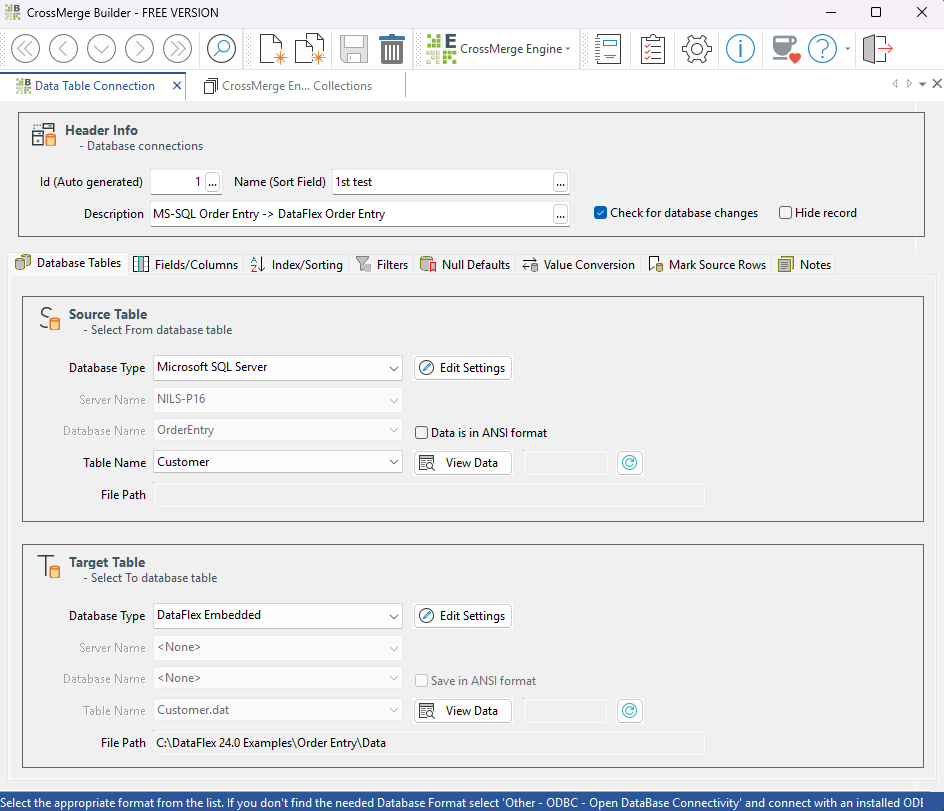

# CrossMerge

CrossMerge is a powerful data synchronization tool designed to seamlessly connect and update different databases.

## Features

- **Easy Integration**: Connect virtually any software package that uses a database with another database in just a few minutes. No modifications to database structures or programming required.
- **User-Friendly Interface**: Use the CrossMerge Builder to easily connect database table pairs (Source and Target) with a simple point-and-click interface.
- **Automated Updates**: Run the CrossMerge Engine to update your data. Schedule it to run at specific times using tools like Windows Scheduled Tasks.

## Licensing and Support

These programs are available as an Open Source version and are free to use. However, the free version does not include support. For support, please contact us at [support@rdctools.com](mailto:support@rdctools.com). You can purchase a full license with lifetime updates and support for only $395.

## Requirements

CrossMerge was compiled under DataFlex version 2024 and requires a DataFlex 2024 Client Engine license to run. Alternatively, if you have a DataFlex Development license, you can compile it with DataFlex 20.0 or later.

---

DataFlex is a registered trademark of Data Access Corporation, Miami, FL, USA. DataFlex is not free software.
