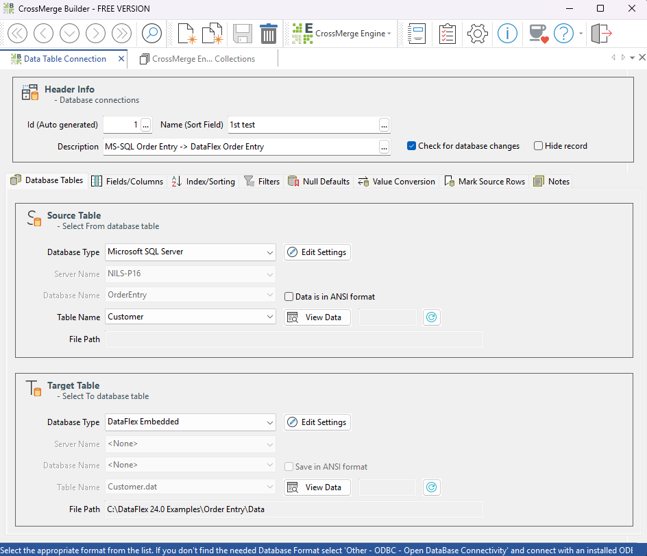

# CrossMerge

**CrossMerge** is a powerful data synchronization tool designed to seamlessly connect and update different databases.

## Features

- **Easy Integration**: Connect virtually any software package that utilizes a database to another database in just a few minutes. No modifications to database structures or programming are required.
- **User-Friendly Interface**: Utilize the CrossMerge Builder to effortlessly connect database table pairs (Source and Target) using a simple point-and-click interface.
- **Automated Updates**: Run the CrossMerge Engine to update your data. You can schedule updates to run at specific times using tools like Windows Scheduled Tasks.

## Licensing and Support

CrossMerge is available as an open-source version, which is free to use. However, please note that the free version does not include support. For support options, please contact us at [support@rdctools.com](mailto:support@rdctools.com). You can purchase a full license with lifetime updates and support for only $395.

## Requirements

CrossMerge was compiled using DataFlex version 2024 and requires a DataFlex 2024 Client Engine license to run. Alternatively, if you have a DataFlex Development license, you can compile it with DataFlex 20.0 or later.

## Setup after cloning

The libraries this workspace uses (DFAbout, DigitalCert, DUF, RDCToolsLib, vwin32fh) are **not**
stored in this repository (they are gitignored). Run **`setup.bat`** once from the repository root
and it provides them, behaving differently by machine so one arrangement serves both maintainer and
user:

- On a machine with the shared RDC library pool next door (a sibling `..\Libraries` carrying the
  marker file `.rdc-library-pool`), it makes `Libraries\` a **junction** to that pool — one shared,
  editable copy of every library.
- Otherwise it **clones** the five libraries into this workspace's own `Libraries\` folder:
  isolated, self-contained, and it never writes anywhere outside this workspace. (DUF comes from
  the current `Library-DUF` repo; the old `DbUpdateFramework` repo is superseded by it.)

It also runs `skip-local-data.cmd` so your local `Data\` database changes stay on your machine.
Either way `Libraries\` is local-only and never committed — re-run `setup.bat` any time it looks
missing or out of date. (Because `Libraries\` may be a junction, do not run `git clean -x` here.)

---

DataFlex is a registered trademark of Data Access Corporation, Miami, FL, USA. Please note that DataFlex is not free software.
